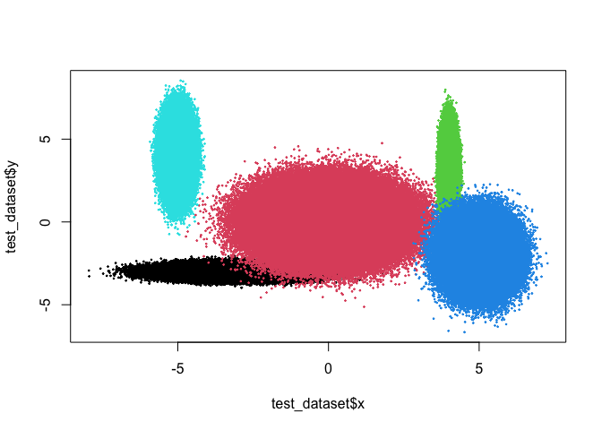
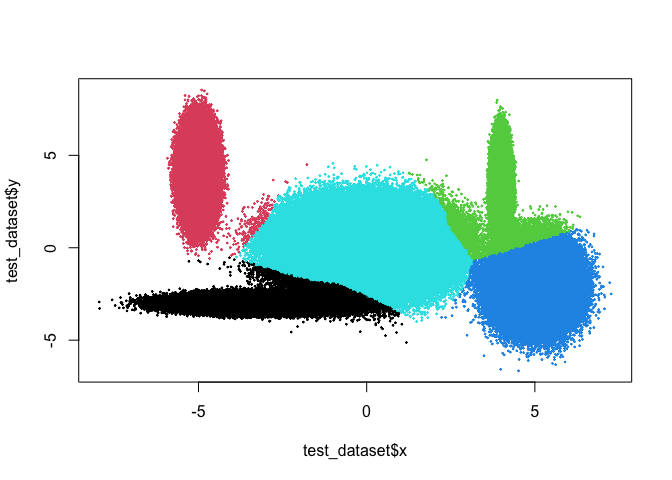

<!-- README.md is generated from README.Rmd. Please edit that file -->

# sbclust

<!-- badges: start -->
<!-- badges: end -->

The goal of sbclust is to provide an approach to cluster large datasets
through a sample-based bagged clustering algorithm, which is effectively
just the `bclust` function from the
[e1071](https://cran.r-project.org/web/packages/e1071/index.html)
package with one tiny edit that allows to grab a sample of the dataset
for each run instead of the whole dataset.

## Installation

You can install the development version of sbclust from
[GitHub](https://github.com/) with:

``` r
# install.packages("devtools")
devtools::install_github("sdesabbata/sbclust")
```

## Example

This is a basic example of clustering a large dataset using `sbclust`:

``` r
library(sbclust)
```

Create test dataset containing three million cases with two attributes
and five clusters, using approach suggested by [Wang et
al. (2008)](https://onlinelibrary.wiley.com/doi/10.1002/int.20268).

``` r
# Size
test_dataset_size <- 3000000

# Proportions of the five clusters
centres_prop <- c(0.2, 0.2, 0.3, 0.1, 0.2)

# Clusters' centers
centres_mean <- array(
  c(-3, 0, 4, 5, -5, -3, 0, 3, -2, 4),
  c(5, 2)
)

# Clusters standard deviation
centres_sd <- array(
  c(1, 1, 0.1, 0.5, 0.2, 0.2, 1, 1, 1, 1),
  c(5, 2)
)

# Values dataset
values_x <- c()
values_y <- c()
values_cluster <- c()
for (i in 1:5) {
  values_x <-
    c(
      values_x,
      rnorm(n = test_dataset_size*centres_prop[i], mean = centres_mean[i, 1], sd = centres_sd[i, 1])
    )
  values_y <-
    c(
      values_y,
      rnorm(n = test_dataset_size*centres_prop[i], mean = centres_mean[i, 2], sd = centres_sd[i, 2])
    )
  values_cluster <-
    c(
      values_cluster,
      rep(as.character(i), test_dataset_size*centres_prop[i])
    )
}

# Create dataset
test_dataset <- data.frame(
  x = values_x,
  y = values_y,
  cluster = values_cluster
)
```

Plot the example dataset.

``` r
plot(
  test_dataset$x, test_dataset$y,
  col = test_dataset$cluster,
  pch = 19,
  cex = 0.2
)
```



Run the clustering algorithm and save the results as a new column of the
dataset.

``` r
# Clustering
start_time <- Sys.time()

clustering_result <-
  sbclust(
    test_dataset[,c("x", "y")],
    centers = 5,
    iter.max = 5000,
  )
#> Committee Member: 1(1)
#>  2(1)
#>  3(1)
#>  4(1)
#>  5(1)
#>  6(1)
#>  7(1)
#>  8(1)
#>  9(1)
#>  10(1)
#> 
#> Computing Hierarchical Clustering

end_time <- Sys.time()

# Check time lapsed
end_time - start_time
#> Time difference of 2.6321 secs

# Save results
test_dataset["sbclust"] <- clustering_result$cluster
```

Plot the clustering results.

``` r
plot(
  test_dataset$x, test_dataset$y,
  col = test_dataset$sbclust,
  pch = 19,
  cex = 0.2
)
```



Compare the list of test centers with the results of the clustering
procedure.

``` r
# Comparison
centres_mean
#>      [,1] [,2]
#> [1,]   -3   -3
#> [2,]    0    0
#> [3,]    4    3
#> [4,]    5   -2
#> [5,]   -5    4
clustering_result$centers
#>              [,1]        [,2]
#> [1,] -4.996561644  3.98322325
#> [2,] -2.979983834 -2.98478670
#> [3,]  3.998812323  2.97560647
#> [4,]  4.994837529 -2.04239691
#> [5,] -0.009966978  0.03353502
```
